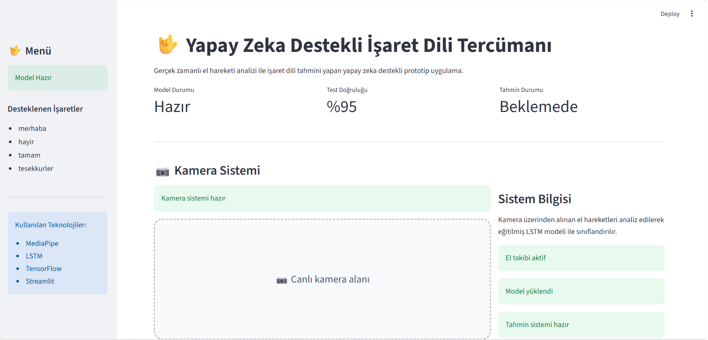
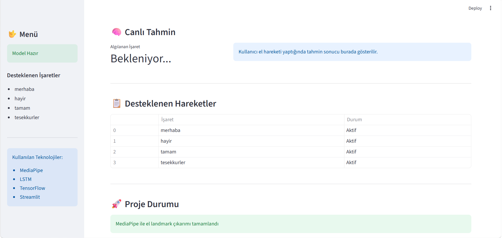
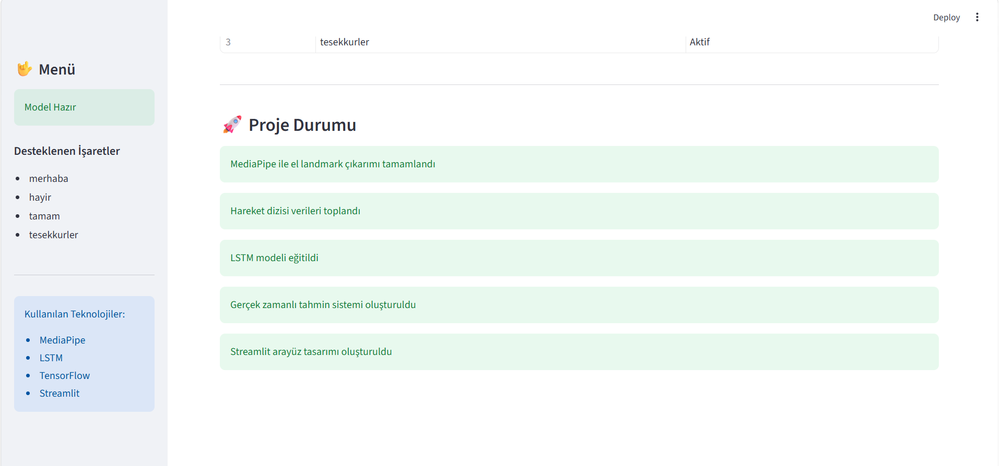
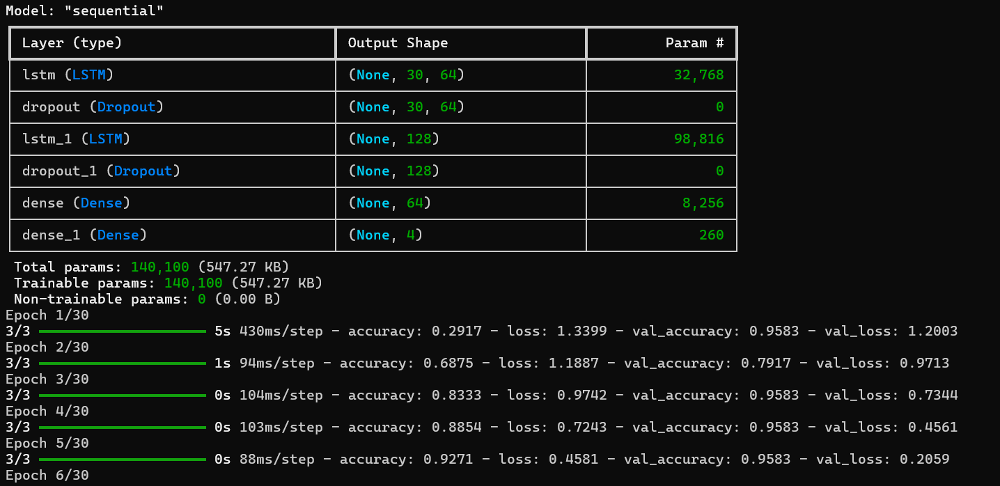
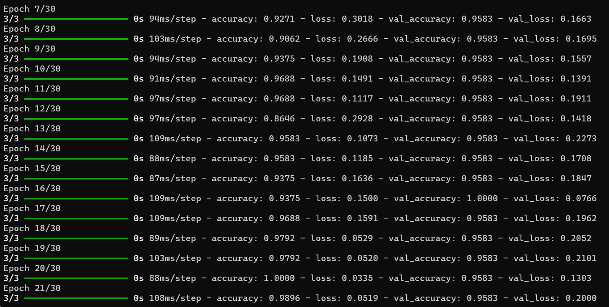
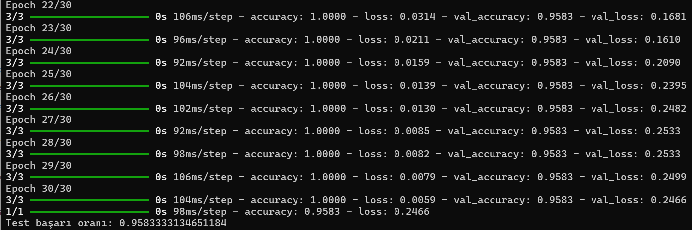

# 🤟 AI Sign Language Translator

Gerçek zamanlı el hareketi analizi ile işaret dili tahmini yapan yapay zeka destekli prototip uygulama.  
Bu proje MediaPipe, TensorFlow LSTM ve Streamlit kullanılarak geliştirilmiştir.

---

## 🚀 Canlı Demo

👉 [Uygulamayı Aç](https://ai-sign-language-translator.streamlit.app/)

---

## 📌 Proje Özellikleri

- Gerçek zamanlı el takibi
- İşaret dili hareket tanıma sistemi
- LSTM tabanlı sıralı hareket analizi
- Streamlit tabanlı modern kullanıcı arayüzü
- MediaPipe ile el landmark çıkarımı
- TensorFlow ile derin öğrenme modeli eğitimi
- Gerçek zamanlı tahmin sistemi
- Dinamik dashboard yapısı
- Çoklu işaret sınıflandırma desteği

---

## 🛠️ Kullanılan Teknolojiler

- Python
- Streamlit
- MediaPipe
- TensorFlow
- OpenCV
- NumPy
- Pandas
- Scikit-learn

---

# 📷 Arayüz Görselleri

## 🖥️ Ana Dashboard



---

## 🧠 Canlı Tahmin Sistemi



---

## 📊 Proje Durumu ve Sistem Bilgileri



---

# 🧠 Model Eğitimi Süreci

LSTM modeli TensorFlow kullanılarak epoch tabanlı şekilde eğitildi.  
Eğitim sürecinde accuracy ve loss değerleri takip edilerek model performansı optimize edildi.

---

## 📌 Model Mimarisi ve İlk Eğitim Adımları



---

## 📈 Eğitim Sürecinin Devamı



---

## ✅ Final Sonuçları ve Test Başarımı



---

# 📷 Desteklenen İşaretler

- merhaba
- hayır
- tamam
- tesekkurler

---

# 🧠 Proje İş Akışı

1. MediaPipe kullanılarak el landmark verileri çıkarılır.
2. Hareket dizileri toplanır ve veri seti oluşturulur.
3. LSTM modeli hareket dizileri ile eğitilir.
4. Gerçek zamanlı tahmin sistemi çalıştırılır.
5. Tahmin sonuçları Streamlit arayüzünde kullanıcıya gösterilir.

---

# ▶️ Projeyi Lokal Olarak Çalıştırma

## 📦 Gereksinimleri Kur

```bash
pip install -r requirements.txt
```

---

## ▶️ Streamlit Uygulamasını Başlat

```bash
streamlit run app.py
```

---

# 📂 Proje Yapısı

```text
ai-sign-language-translator/
│
├── images/                     # README görselleri
├── sequence_data/              # Hareket veri setleri
│
├── app.py                      # Streamlit arayüzü
├── collect_data.py             # Statik veri toplama sistemi
├── collect_sequence_data.py    # Hareket dizisi veri toplama
├── hand_tracking.py            # MediaPipe el takibi
├── predict_lstm.py             # Gerçek zamanlı LSTM tahmini
├── predict_sign.py             # Statik tahmin sistemi
├── train_lstm_model.py         # LSTM model eğitimi
├── train_model.py              # Temel model eğitimi
├── requirements.txt            # Gerekli kütüphaneler
├── lstm_sign_model.h5          # Eğitilmiş LSTM modeli
├── lstm_label_encoder.pkl      # Label encoder
└── README.md
```

---

# 🎯 Model Performansı

- Test Accuracy: %95+
- Gerçek zamanlı tahmin desteği
- LSTM tabanlı hareket analizi
- Çoklu işaret sınıflandırma sistemi
- Sequence-based deep learning yaklaşımı

---

# 🌐 Canlı Uygulama

👉 https://ai-sign-language-translator.streamlit.app/

---

# 👩‍💻 Geliştirici

**Leyla İkra Başer**  
Bilgisayar Mühendisliği Öğrencisi

GitHub: https://github.com/ikrabaser

---

# ⭐ Not

Bu proje eğitim, araştırma ve yapay zeka tabanlı işaret dili teknolojileri üzerine geliştirilmiş bir prototype çalışmasıdır.
